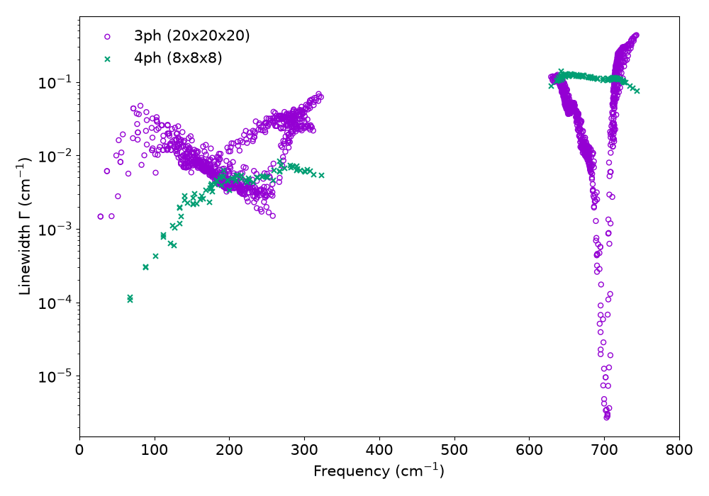

.. _label_tutorial_bas_4ph:

.. raw:: html

    

.. role:: red

BAs: four-phonon scattering in the lattice thermal conductivity
---------------------------------------------------------------

.. admonition:: At a glance
   :class: tip

   :Goal: Calculate the lattice thermal conductivity of cubic boron arsenide (BAs) with three- and four-phonon scattering.
   :You will learn:
      - how to switch on four-phonon scattering (``INCLUDE_4PH``, ``KMESH_COARSE``, ``ISMEAR_4PH``, ``INTERPOLATOR``)
      - how **anphon** reuses the linewidths stored in ``PREFIX``.kappa.h5 so that a 4ph run does not repeat the 3ph part
      - how to go beyond the relaxation-time approximation with ``SOLVER = IBTE``
   :Prerequisites: ALAMODE (**anphon**) and an MPI environment. The force constants up to fourth order are provided, so no DFT calculation is needed.
   :Example files: ``example/BAs``
   :Run time: With ``mpirun -np 4`` and two OpenMP threads per process on a laptop, the three steps take about 15 s, 20 s, and 2 minutes.

Cubic BAs (zincblende structure) was predicted to have an ultrahigh lattice thermal conductivity
of more than 2000 W/mK at room temperature from first-principles calculations that include only three-phonon (3ph) scattering [#lindsay2013]_.
The reason is a very small three-phonon phase space.
Because As is about seven times heavier than B, there is a large gap between the acoustic and the optical branches,
so that two acoustic phonons cannot merge into an optical phonon.
In addition, the acoustic branches are bunched together, which suppresses the scattering among acoustic phonons.

When three-phonon scattering is this weak, four-phonon (4ph) scattering becomes important.
Feng, Lindsay, and Ruan showed that 4ph scattering reduces the predicted thermal conductivity of BAs substantially [#feng2017]_,
and three experiments reported room-temperature values of about 1000--1300 W/mK in 2018 [#kang2018]_ [#li2018]_ [#tian2018]_.

In this tutorial, we calculate the thermal conductivity of BAs at three levels of theory:

#. :ref:`Three-phonon scattering in the RTA <tutorial_BAs_step1>`
#. :ref:`Add four-phonon scattering <tutorial_BAs_step2>`
#. :ref:`Go beyond the RTA with the iterative BTE <tutorial_BAs_step3>`

followed by a :ref:`comparison of the results <tutorial_BAs_results>`.
Each step has its own input file, :red:`step1_3ph.in`, :red:`step2_4ph.in`, and :red:`step3_ibte.in`.

The input files and the reference outputs are provided in **example/BAs/reference**.

.. _tutorial_BAs_prepare:

Input files and force constants
~~~~~~~~~~~~~~~~~~~~~~~~~~~~~~~

Move to the example directory and copy the three input files of this tutorial:

.. code-block:: console

   $ cd ${ALAMODE_ROOT}/example/BAs
   $ cp reference/step1_3ph.in reference/step2_4ph.in reference/step3_ibte.in .

The directory already contains the two files that the inputs refer to:

* :red:`BAs-paw-40-480-N60-rcut12-8.xml` contains the harmonic, cubic, and quartic force constants
  (the ``HARMONIC``, ``ANHARM3``, and ``ANHARM4`` sections) of a 216-atom supercell,
  which is the 3x3x3 conventional cell of BAs. The file was written by **alm** 1.1.0.
* :red:`BAs.born` contains the dielectric constant and the Born effective charges.
  BAs is a polar material, so the dipole-dipole interaction splits the LO and TO modes near :math:`\Gamma`.
  ``NONANALYTIC = 2`` adds this non-analytic correction to the dynamical matrix by the mixed-space approach,
  and ``BORNINFO`` gives the file name.
  See the :ref:`PbTe tutorial <label_tutorial_pbte>` for more about the ``NONANALYTIC`` options.

.. important::
   **anphon** restarts from :red:`PREFIX.kappa.h5` whenever that file exists (see :ref:`step 2 <tutorial_BAs_step2>`).
   If you run the tutorial again, or if a :red:`BAs.kappa.h5` from another calculation is in the directory,
   remove it before step 1:

   .. code-block:: console

      $ rm -f BAs.kappa.h5

.. _tutorial_BAs_step1:

Step 1. Three-phonon scattering in the RTA
~~~~~~~~~~~~~~~~~~~~~~~~~~~~~~~~~~~~~~~~~~

The first input :red:`step1_3ph.in` is an ordinary thermal conductivity calculation like the one in the :ref:`Si tutorial <label_tutorial_01>`:

.. literalinclude:: ../../../example/BAs/reference/step1_3ph.in

:download:`Download step1_3ph.in <../../../example/BAs/reference/step1_3ph.in>`

The 3ph linewidths are calculated on a 20x20x20 :math:`k` mesh with the adaptive smearing (``ISMEAR = 2``) from 100 K to 1000 K.
``ISOTOPE = 1`` adds the scattering by isotope disorder, which is sizable in BAs because natural boron is a mixture of :sup:`10`\ B and :sup:`11`\ B
(As has only one stable isotope).
Run **anphon**:

.. code-block:: console

   $ export OMP_NUM_THREADS=2
   $ mpirun -np 4 anphon step1_3ph.in > step1_3ph.log

The 20x20x20 mesh has 256 irreducible :math:`k` points, so the linewidths of :math:`256 \times 6 = 1536` modes are calculated.
The thermal conductivity tensor is written to :red:`BAs.kl`, and all the linewidths are stored in :red:`BAs.kappa.h5`.
At 300 K, :math:`\kappa_{xx}` is 1218 W/mK.

.. _tutorial_BAs_step2:

Step 2. Add four-phonon scattering
~~~~~~~~~~~~~~~~~~~~~~~~~~~~~~~~~~

The second input :red:`step2_4ph.in` differs from the first one only in the ``&kappa`` field:

.. literalinclude:: ../../../example/BAs/reference/step2_4ph.in
   :lines: 22-29

:download:`Download step2_4ph.in <../../../example/BAs/reference/step2_4ph.in>`

* ``INCLUDE_4PH = 1`` switches on the four-phonon scattering. It requires the quartic force constants, which are in the ``FCSFILE``.
* ``KMESH_COARSE = 8 8 8``: 4ph calculations are far more expensive than 3ph ones, so the 4ph scattering rates are calculated on this coarser mesh
  and then interpolated onto the 20x20x20 mesh of the ``&kpoint`` field.
* ``ISMEAR_4PH = 2`` selects the adaptive Gaussian smearing for the 4ph processes, independently of ``ISMEAR`` for the 3ph ones.
  Adaptive smearing is recommended on coarse 4ph meshes, where a single fixed width is hard to converge.
* ``INTERPOLATOR = log-linear`` interpolates the logarithm of the 4ph scattering rates trilinearly (the default).
* ``RESTART_4PH = 0`` calculates the 4ph linewidths from scratch instead of reusing stored ones (see below).

Run **anphon** with the same ``PREFIX``:

.. code-block:: console

   $ mpirun -np 4 anphon step2_4ph.in > step2_4ph.log

Because :red:`BAs.kappa.h5` from step 1 exists, ``RESTART`` defaults to 1, and **anphon** loads the 3ph linewidths.
``RESTART_4PH = 0`` in :red:`step2_4ph.in` makes **anphon** calculate the 4ph linewidths from scratch.
Without it, **anphon** would import the 4ph linewidths of an older version from the legacy file :red:`BAs.4ph.result`
in the same directory (with only a warning that the force constant files differ).
The log file shows that only the 4ph part is calculated::

    1536 previously computed 3ph modes were loaded from BAs.kappa.h5.
    ...
    Start computing 3-phonon (bubble) self-energies ...
    Total Number of phonon modes to be calculated : 0
    ...
    Start computing 4-phonon self-energies ...
    Total Number of phonon modes to be calculated : 174

The 8x8x8 mesh has 29 irreducible :math:`k` points, which gives :math:`29 \times 6 = 174` modes.
The 3ph and 4ph linewidths are stored side by side in :red:`BAs.kappa.h5`, and each channel restarts separately.
This is the practical point of this step: you can converge the 3ph part first and add the expensive 4ph part later,
or test several 4ph settings with ``RESTART_4PH = 0``, without repeating the 3ph calculation.
The same mechanism lets you resume a calculation that was stopped before the end.

.. note::
   The stored linewidths are reused as they are.
   If you change the force constants or a setting that changes the linewidths, such as the :math:`k` mesh or the smearing,
   delete :red:`BAs.kappa.h5`, or set ``RESTART = 0`` (3ph part) or ``RESTART_4PH = 0`` (4ph part) in the ``&kappa`` field.
   ``RESTART_4PH = 0`` discards only the 4ph linewidths and keeps the 3ph ones.

With ``INCLUDE_4PH = 1``, the output :red:`BAs.kl` is replaced by two files:

* :red:`BAs.kl3`: the thermal conductivity with three-phonon (and isotope) scattering only. It is the same as :red:`BAs.kl` of step 1.
* :red:`BAs.kl4`: the thermal conductivity with three- and four-phonon scattering.

At 300 K, the four-phonon scattering reduces :math:`\kappa_{xx}` from 1218 W/mK to 811 W/mK, by one third.
The linewidths in :red:`BAs.kappa.h5` (group ``/scattering/3ph`` and ``/scattering/4ph``, see :ref:`label_hdf5_kappa`) show where this comes from.
The following figure plots them at 300 K, each on its own :math:`k` mesh.

   Three- and four-phonon linewidths of BAs at 300 K. The lifetime is :math:`\tau = 1/(2\Gamma)`, with :math:`\Gamma` as an angular frequency.

Above 600 cm\ :sup:`-1`, the 3ph linewidths of the optical modes drop by orders of magnitude near 700 cm\ :sup:`-1`,
where the three-phonon processes are nearly forbidden, and the 4ph channel dominates.
For the acoustic modes above about 150 cm\ :sup:`-1`, the 4ph linewidths are comparable to the 3ph ones.
The plotted data were extracted from :red:`BAs.kappa.h5` with ``h5py`` and are provided as :red:`BAs_linewidth_3ph_300K.txt` and :red:`BAs_linewidth_4ph_300K.txt` in **example/BAs/reference**; the zero linewidths of the acoustic modes at :math:`\Gamma` are omitted.

.. _tutorial_BAs_step3:

Step 3. Go beyond the RTA with the iterative BTE
~~~~~~~~~~~~~~~~~~~~~~~~~~~~~~~~~~~~~~~~~~~~~~~~

In the relaxation-time approximation (RTA), every scattering process is treated as if it destroyed the heat current.
Normal processes, which conserve the crystal momentum, do not, and they dominate the three-phonon scattering in BAs.
The RTA therefore underestimates the thermal conductivity of BAs, and the linearized Boltzmann transport equation (BTE) should be solved.
The third input :red:`step3_ibte.in` adds ``SOLVER = IBTE`` to the second one:

.. literalinclude:: ../../../example/BAs/reference/step3_ibte.in
   :lines: 22-29

:download:`Download step3_ibte.in <../../../example/BAs/reference/step3_ibte.in>`

.. code-block:: console

   $ mpirun -np 4 anphon step3_ibte.in > step3_ibte.log

The iterative solver needs the full three-phonon collision matrix, which is not stored in :red:`BAs.kappa.h5`, so this step recalculates the 3ph transition probabilities.
The 4ph linewidths are reused (``174 previously computed 4ph modes were loaded from BAs.kappa.h5.``),
and they enter as out-scattering terms only: the header of the output file says ``4ph is included non-iteratively``.
The result is written to :red:`BAs.kl_iter`.

.. warning::
   ``SOLVER = IBTE`` is a pilot implementation under development, and **anphon** prints a warning to that effect at the start of the run.
   Please check the validity of the results carefully.

The log file prints :math:`\kappa` at every iteration for each temperature.
With the default ``ITER_THRESHOLD = 0.02``, :math:`\kappa` still changes by about 2% between the last two iterations,
so use a smaller :ref:`ITER_THRESHOLD <anphon_iter_threshold>` for production calculations.
At 300 K, :math:`\kappa_{xx}` is 1171 W/mK, about 45% higher than the RTA value with the same scattering processes.
The background of the iterative solution is explained in :ref:`this page <kappa_beyond_rta>`.

.. _tutorial_BAs_results:

Results
~~~~~~~

The thermal conductivity :math:`\kappa_{xx}` at 300 K from the three steps is summarized below
(:math:`\kappa_{yy}` and :math:`\kappa_{zz}` are the same by cubic symmetry).

.. list-table::
   :header-rows: 1
   :widths: 40 30 30

   * - Scattering and solver
     - Output file
     - :math:`\kappa_{xx}` at 300 K (W/mK)
   * - 3ph + isotope, RTA
     - :red:`BAs.kl` (:red:`BAs.kl3`)
     - 1218
   * - 3ph + 4ph + isotope, RTA
     - :red:`BAs.kl4`
     - 811
   * - 3ph + 4ph + isotope, iterative BTE
     - :red:`BAs.kl_iter`
     - 1171

The experimental values are about 1000--1300 W/mK [#kang2018]_ [#li2018]_ [#tian2018]_.

.. interactive-plot::
   :kind: xy
   :series: ../../../example/BAs/reference/BAs.kl3 1:2 3ph, RTA
      ../../../example/BAs/reference/BAs.kl4 1:2 3ph + 4ph, RTA
      ../../../example/BAs/reference/BAs.kl_iter 1:2 3ph + 4ph, iterative BTE
   :xlabel: Temperature (K)
   :ylabel: Lattice thermal conductivity (W/mK)
   :log: xy
   :markers:
   :fallback: ../../img/BAs_kappa.png
   :scale: 60%
   :align: center

   Temperature dependence of :math:`\kappa_{xx}` of BAs.

The 4ph scattering grows faster with temperature than the 3ph scattering, so its effect is small at 100 K (2319 W/mK versus 2277 W/mK)
and large at 1000 K (421 W/mK versus 123 W/mK).
The iterative solution raises :math:`\kappa` at all temperatures, most strongly at low temperatures, where the normal processes dominate.

.. note::
   The inputs of this tutorial are chosen so that it runs in a few minutes on a laptop.
   For a quantitative result, check the convergence of :math:`\kappa` with respect to the 3ph :math:`k` mesh of the ``&kpoint`` field
   and, independently, with respect to ``KMESH_COARSE``. ``WRITE_INTERPOL = 1`` writes the interpolated 4ph linewidths on the dense mesh,
   which helps to check the interpolation.
   Thanks to the restart mechanism of step 2, testing ``KMESH_COARSE`` does not require the 3ph calculation to be repeated:
   set ``RESTART_4PH = 0`` so that only the 4ph linewidths are recalculated.

.. rubric:: References

.. [#lindsay2013] L. Lindsay, D. A. Broido, and T. L. Reinecke, Phys. Rev. Lett. **111**, 025901 (2013).
.. [#feng2017] T. Feng, L. Lindsay, and X. Ruan, Phys. Rev. B **96**, 161201(R) (2017).
.. [#kang2018] J. S. Kang *et al.*, Science **361**, 575 (2018).
.. [#li2018] S. Li *et al.*, Science **361**, 579 (2018).
.. [#tian2018] F. Tian *et al.*, Science **361**, 582 (2018).
